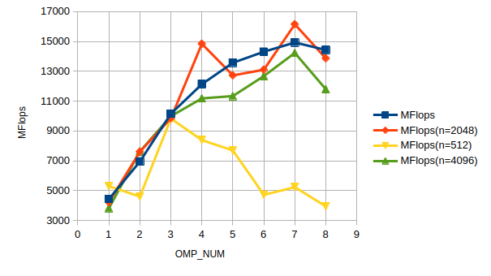

# TD1 (Axel Richard)

`pandoc -s --toc README.md --css=./github-pandoc.css -o README.html`

## lscpu

*lscpu donne des infos utiles sur le processeur : nb core, taille de cache :*

```
Architecture:             x86_64
  CPU op-mode(s):         32-bit, 64-bit
  Address sizes:          39 bits physical, 48 bits virtual
  Byte Order:             Little Endian
CPU(s):                   8
  On-line CPU(s) list:    0-7
Vendor ID:                GenuineIntel
  Model name:             11th Gen Intel(R) Core(TM) i5-1135G7 @ 2.40GHz
    CPU family:           6
    Model:                140
    Thread(s) per core:   2
    Core(s) per socket:   4
    Socket(s):            1
    Stepping:             1
    CPU(s) scaling MHz:   26%
    CPU max MHz:          4200,0000
    CPU min MHz:          400,0000
    BogoMIPS:             4838,40
Virtualization features:  
  Virtualization:         VT-x
Caches (sum of all):      
  L1d:                    192 KiB (4 instances)
  L1i:                    128 KiB (4 instances)
  L2:                     5 MiB (4 instances)
  L3:                     8 MiB (1 instance)
```

## Exercice 1 : Produit matrice-matrice

### 1 - Effet de la taille de la matrice

  | n              | MFlops  |
  | -------------- | ------- |
  | 1023           | 742.099 |
  | 1024 (origine) | 398.381 |
  | 1025           | 596.586 |
  | 1050           | 486.105 |
  | 1076           | 475.577 |
  | 1102           | 381.845 |
  | 1200           | 375.653 |
  | 1300           | 313.503 |
  | 1400           | 277.656 |
  | 1500           | 264.61  |
  | 2048           | 119.096 |

*Expliquer les résultats.*

Lors de la mise en cache, le CPU calcule l'adresse dans le cache en faisant (@RAM % 1024). Or :
* pour une itération de multiplication, on a besoin de lire la première valeur de A, donc sont mises en cache a_00 et les 8 valeurs suivantes
* pour l'itération suivante, on besoin de lire la 2e ligne de A, donc le CPU effectue un saut de 1024 (la dimension de A) ; mais 1024 % 1024 = 0 donc la même ligne de cache est utilisée.
* ainsi pour une dimension de 1024, le cache est toujours réécrit, donc jamais réutilisé. Le CPU travaille donc en RAM uniquement, ce qui fait chuter les performances.
* pour d = 1023, 1023 % 1024 != 0 donc il n'y pas de réécriture systématique du cache. Le cache est alors utilisé en lecture, ce qui donne de meilleures performances.

### 2 - Permutation des boucles

*Expliquer comment est compilé le code (ligne de make ou de gcc) : on aura besoin de savoir l'optim, les paramètres, etc. Par exemple :*
`make TestProduct.exe && ./TestProduct.exe 1024`

```bash
g++ -fopenmp -std=c++14 -O3 -march=native -Wall -c TestProductMatrix.cpp -o TestProductMatrix.o
g++ -fopenmp -std=c++14 -O3 -march=native -Wall -c Matrix.cpp -o Matrix.o
g++ -fopenmp -std=c++14 -O3 -march=native -Wall -c ProdMatMat.cpp -o ProdMatMat.o
g++ -fopenmp -std=c++14 -O3 -march=native -Wall TestProductMatrix.o Matrix.hpp Matrix.o ProdMatMat.o -o TestProductMatrix.exe -lpthread
```

* `-fopenmp` : activer le support d'OpenMP
* `-std=c++14` : standard C++ de 2014
* `-O3` : niveau d'optimisation 3 de GCC
* `-Wall` : activer tous les warnings de GCC
* `-march=native` : optimiser le binaire pour la machine sur laquelle il est compilé

| order             | time (s) | MFlops (n=1024) |
| ----------------- | -------- | --------------- |
| `i,j,k` (origine) | 2.63536  | 814.872         |
| `j,i,k`           | 3.20974  | 669.053         |
| `i,k,j`           | 2.73764  | 424.591         |
| `k,i,j`           | 9.56233  | 224.577         |
| `j,k,i`           | 0.313815 | 6843.16         |
| `k,j,i`           | 0.398427 | 5389.9          |


*Discuter les résultats.*

L'opération  à réaliser est la suivante : `C(i, j) += A(i, k) * B(k, j)`. Cette opération nécessite la lecture de `A(i, k)` et de `B(k, j)`. Dans cette implémentation, `A` et `B` sont stockées sous formes de listes de listes de colonnes. Donc la mémoire utilisée par le programme a la structure
```txt
[A(i, k); A(i+1,k); A(i+2, k) ... etc]
```
c'est-à-dire que les colonnes sont conjointes dans la RAM.
Or, d'après le cours, on sait que lire valeur depuis la RAM charge aussi  dans le cache les valeurs conjointes dans la RAM. Donc lire `A(i,k)` charge aussi `A(i+1,k), A(i+2, k) ... A(i+8, k)`. 
Ainsi, dans la permutation `j,k,i`, la variable qui change le plus souvent est i, ce qui correspond aux valeurs chargées dans le cache. Cela explique donc pourquoi cette permutation des boucles donne le meilleur résultat.

### 3 et 4 - OMP sur la meilleure boucle

`make TestProduct.exe && OMP_NUM_THREADS=8 ./TestProduct.exe 1024`

| OMP_NUM | MFlops  | MFlops(n=2048) | MFlops(n=512) | MFlops(n=4096) |
| ------- | ------- | -------------- | ------------- | -------------- |
| 1       | 7142.27 | 5395.81        | 8068.48       | 5362.13        |
| 2       | 7110.69 | 5447.11        | 8467.02       | 5345.9         |
| 3       | 6955.71 | 5417.31        | 7730.97       | 5369.84        |
| 4       | 6963.14 | 5153.35        | 8561.53       | 5228.69        |
| 5       | 6680.09 | 5341.49        | 7276.03       | 5357.67        |
| 6       | 6613.53 | 5322.82        | 6983.66       | 5076.28        |
| 7       | 6510.1  | 5230.89        | 6852.23       | 5229.06        |
| 8       | 6627.81 | 5265.54        | 7226.9        | 5036.55        |

*Tracer les courbes de speedup (pour chaque valeur de n), discuter les résultats.*

On obtient les courbes suivantes : 



On remarque qu'à partir de 4, les performances diminuent. Cela est sûrement dû à une saturation de la bande passante du fait des différents threads qui essaient d'accéder à la mémoire en même temps.

### 5 - Produit par blocs

`make TestProduct.exe && ./TestProduct.exe 1024`

| szBlock | MFlops  | MFlops(n=2048) | MFlops(n=512) | MFlops(n=4096) |
| ------- | ------- | -------------- | ------------- | -------------- |
| 32      | 7203.63 | 6933.03        | 5951.44       | 6707.97        |
| 64      | 8163.87 | 8020.68        | 7563.76       | 6876.04        |
| 128     | 7794.91 | 6734           | 7219.98       | 5742.93        |
| 256     | 7920.5  | 7678.64        | 7365.66       | 6116.13        |
| 512     | 7032.53 | 7162.45        | 7581.16       | 6604.03        |
| 1024    | 5237.32 | 4765.95        | 7636.81       | 3821.67        |

*Discuter les résultats.*

On constate que le passage d'une taille de blocks de 32 à 64 augmente les performances quelle que soit la taille de _n_. Cependant, passé ce seuil, la taille des blocks semble avoir peu d'influence.

### 6 - Bloc + OMP


| szBlock | OMP_NUM | MFlops  | MFlops(n=2048) | MFlops(n=512) | MFlops(n=4096) |
| ------- | ------- | ------- | -------------- | ------------- | -------------- |
| 1024    | 1       | 6725.49 | 6058.91        | 7962.14       | 5060.07        |
| 1024    | 8       | 6408.   | 6353.12        | 7257.47       | 5351.71        |
| 512     | 1       | 7967.41 | 8097.72        | 7514.1        | 6158.58        |
| 512     | 8       | 7104.71 | 8078.97        | 6798.3        | 6417.03        |

*Discuter les résultats.*

On constate que l'augmentation de la parallélisation devient intéressante pour des tailles de blocks supérieures à 512.

### Comparaison avec BLAS, Eigen et numpy

*Comparer les performances avec un calcul similaire utilisant les bibliothèques d'algèbre linéaire BLAS, Eigen et/ou numpy.*

On teste avec BLAS (code fourni).

| szBlock | OMP_NUM | MFlops   | MFlops(n=2048) | MFlops(n=512) | MFlops(n=4096) |
| ------- | ------- | -------- | -------------- | ------------- | -------------- |
| 1024    | 1       | 98 805.7 | 190 036        | 72 622.2      | 191 505        |
| 1024    | 8       | 144 555  | 185 797        | 57 530.3      | 194 319        |
| 512     | 1       | 109 241  | 184 449        | 63 314        | 189 548        |
| 512     | 8       | 129 063  | 190 388        | 48 935.5      | 173 782        |

L'évolution des performances est similaire à celle observée dans les questions précédentes, mais les performances en elles-même sont bien meilleures en utilisant une bibliothèque déjà optimisée.

